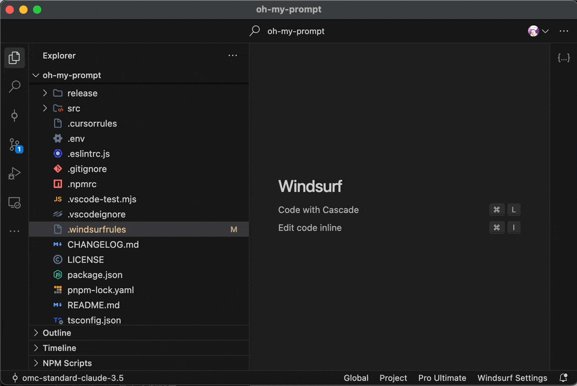

<div align="center">

```shell
                 @@@@@@   @@@  @@@     @@@@@@@@@@   @@@ @@@  
                @@@@@@@@  @@@  @@@     @@@@@@@@@@@  @@@ @@@  
                @@!  @@@  @@!  @@@     @@! @@! @@!  @@! !@@  
                !@!  @!@  !@!  @!@     !@! !@! !@!  !@! @!!  
                @!@  !@!  @!@!@!@!     @!! !!@ @!@   !@!@!   
                !@!  !!!  !!!@!!!!     !@!   ! !@!    @!!!   
                !!:  !!!  !!:  !!!     !!:     !!:    !!:    
                :!:  !:!  :!:  !:!     :!:     :!:    :!:    
                ::::: ::  ::   :::     :::     ::      ::    
                 : :  :    :   : :      :      :       :     


                @@@@@@@   @@@@@@@    @@@@@@   @@@@@@@@@@   @@@@@@@   @@@@@@@  
                @@@@@@@@  @@@@@@@@  @@@@@@@@  @@@@@@@@@@@  @@@@@@@@  @@@@@@@  
                @@!  @@@  @@!  @@@  @@!  @@@  @@! @@! @@!  @@!  @@@    @@!    
                !@!  @!@  !@!  @!@  !@!  @!@  !@! !@! !@!  !@!  @!@    !@!    
                @!@@!@!   @!@!!@!   @!@  !@!  @!! !!@ @!@  @!@@!@!     @!!    
                !!@!!!    !!@!@!    !@!  !!!  !@!   ! !@!  !!@!!!      !!!    
                !!:       !!: :!!   !!:  !!!  !!:     !!:  !!:         !!:    
                :!:       :!:  !:!  :!:  !:!  :!:     :!:  :!:         :!:    
                 ::       ::   :::  ::::: ::  :::     ::    ::          ::    
                 :         :   : :   : :  :    :      :     :           :          

```

<h1 align="center">Oh My Prompt</h1>

<p align="center">
  ✨ Your Next-generation Prompt Management System for AI IDEs ✨
</p>

<p align="center">
  
</p>

English | [中文](./README.zh-CN.md) | [VScode](https://marketplace.visualstudio.com/items?itemName=markshawn2020.oh-my-prompt) | [Open Visx](https://open-vsx.org/extension/markshawn2020/oh-my-prompt) | [Releases](https://github.com/markshawn2020/oh-my-prompt/releases)

</div>

# Oh My Prompt

A sophisticated prompt management system for AI-powered IDEs, enabling seamless management and switching between Global and Project Prompts for platforms like Windsurf and Cursor.



## Key Features

### Status Bar Integration
- Real-time display of active Global and Project Prompts
- One-click prompt configuration switching
- Quick access to prompt editing interface

### Intelligent Prompt Management
- Automatic scanning and loading of TOML-formatted prompts
- Native detection of existing `.windsurfrules` or `.cursorrules`
- In-editor prompt file modification support

### Cross-platform Synchronization
- Windsurf Global Prompt synchronization
- Project Prompt synchronization with `.windsurfrules`
- *(Coming Soon)* Cursor configuration integration

## Installation

### VS Code / Cursor / Windsurf / Other IDEs

Search for "Oh My Prompt" in your IDE's extension marketplace and install to get started.

## Usage

1. Monitor active Global and Project Prompts via the status bar
2. Access the Quick Pick menu by clicking the status bar items
3. Select or modify your desired prompts

## Architecture

### Synchronization Mechanism

```
Oh My Prompt Store        IDE Rules Files
(TOML with metadata)      (Plain text)
[~/.oh-my-prompt/]        [IDE specific paths]
     ↓    ↑                    ↑    ↓
   Export  Import           Apply  Save
```

### Prompt Specification

Prompts are stored in `~/.neurora/oh-my-prompt/prompts/{type}` using TOML format:

```toml
content = """
your prompt content here
"""

[meta]
type = "global" | "project"
id = "xxx"
name = "xxx"
description = "xxx"
author = "xxx"
version = "xxx"
date = "xxx"
license = "xxx"
```

## Development

1. Clone the repository
2. Execute `pnpm install`
3. Open the project in VS Code
4. Press F5 to start debugging

## Contributing

Issues and Pull Requests are welcome! Please feel free to contribute to the project.

## License

This project is licensed under the MIT License - see the LICENSE file for details.

---

**Enhance your AI development experience with Oh My Prompt!**
