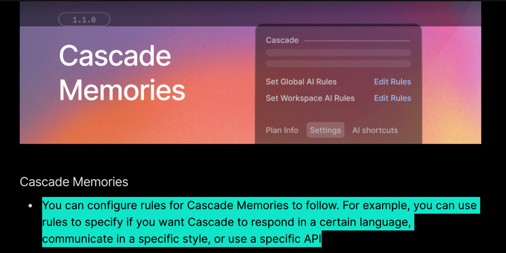

# Oh My Prompt： 一种 AI IDE 多 prompt 管理系统

## 背景

以 cursor / windsurf 为代表的 AI IDE 越来越火，成为大模型新时代程序员必须掌握的开发工具，它们都提供了配置 system prompt 的功能，并且还包括 global、project 两个层级。

cursor 率先支持这一特性，windsurf 后续也做了跟进（2024-12-12）：



但我实际使用下来，有一些不便的地方：
1. 只允许单一配置，不方便 prompt 专业户在多套 prompt 中对比测试与调整
2. 入口较深，不方便随时修改
3. 不同项目之间的 prompt 往往可以复用，或作简单修改，因此 prompt 应该与项目解耦，就像一个程序依赖包一样，应该支持跨程序查看与选用
* 4. 需要一个 web 端可以查看与候选 prompt，并一键导入
* 5. 需要一个地方，可以交流 prompt 的实际体感

关于 1，我花了点时间认真想了一下，用户真地需要多套 global prompt 吗？我一开始想不通，就好比一个人就应该只有一个底色一样。但事实上，有时候我们就是想换个风格，比如从严肃的工业蓝转向幽默的基佬紫，等等。因此，更换 global prompt 的实际需求确实是存在的，尽管当我们撸起袖子加油干的时候，老板对我们的期待往往是：“你已经想清楚了”，也就是说“你不应该再更换 prompt 了”。但，听我说，谢谢你。

基于上述问题，本项目旨在提供一种简单易用的多 prompt 管理系统，方便开发者灵活管理不同项目的 prompt，目前将优先实现一款 vscode 插件，它支持在状态栏独立切换 global 和 project prompt，同步分发在 vscode / open-vsx 插件市场。

## 产品

### v1.0

第一版的设计目标有两种，一种是专注于呈现尽可能多的 prompt，便利用户复制粘贴；还有一种是专注于切换不同的 prompt，用户需要自行寻找 prompt 源。

考虑到 [.CursorRules](https://dotcursorrules.com/) 这样的网站已经有了，它们的 UI、筛选功能也不错，所以我们应该尽可能更多地 focus 在与 IDE 的内部集成上。

基于这个判断，第一版应该实现最基本的多 prompt 切换。

我们应该在状态栏上设置两个按钮，分别显示用户当前所采用的 global、project prompt，点击后应该弹出一个 picker，picker 里应该允许用户编辑或者切换 prompt（已 demo 确认 picker item 里支持额外的按钮交互）。

用户点击 item 触发 prompt 切换：
- windsurf global：写入 `~/.codeium/windsurf/memories/global_rules.md`
- windsurf project：写入 `$/.windsurfrules`
- cursor global：复制，并跳转打开 cursor settings
- cursor project：写入 `~/.cursorrules`

值得注意的是：当用户打开一个新的 project 的时候，有可能已经存在 `.windsurfrules` 或者 `.cursorrules` 文件，这个文件应该自动加载到我们的 prompt 管理系统，这样用户就可以在其他的项目中也能选配使用。

因此，我们的 prompt 管理系统应该支持多个 prompt，由于 vscode 插件的用户配置里字符串显示只能一行，所以 prompt 不适合在用户配置里直接配置，应该采用文件形式进行组织，例如存放在 `~/.oh-my-prompt/prompts/{type}` 文件夹下，文件名为 `xxx.toml`，文件格式为 toml，提供一个 `content` 字段方便用户输入多行 prompt，大致格式为：

```toml
meta = {
    type = "global" | "project",
    id = "xxx",
    name = "xxx",
    description = "xxx",
    author = "xxx",
    version = "xxx",
    date = "xxx",
    license = "xxx",
}

content = """
prompt1
prompt2
prompt3
"""
```

所以在 IDE 里，要有个地方点击后就能跳转到目标文件，编辑，然后保存。保存的时候，应该要有一个 post-hook，允许进行一些格式化检查、配置同步等。不确定 vscode 系统是否能够在文件保存的时候执行 post-hook，即便不可以，基于稳健性目标考虑，我们也应该在 IDE 中提供一个入口，能让用户手动执行。

#### Features

1. 状态栏功能
   - [ ] 在状态栏显示产品 Logo
   - [x] 显示当前激活的 Global Prompt 名称（使用特定颜色标识）
   - [x] 显示当前激活的 Workspace Prompt 名称（使用特定颜色标识）
   - [x] 点击状态栏项目时显示 Quick Pick 菜单

2. Prompt 管理
   - [x] 自动扫描并加载 `~/.oh-my-prompt/prompts/{type}` 下的所有 TOML 格式 prompt
   - [x] 自动检测并加载项目中已存在的 `.windsurfrules` 或 `.cursorrules`
   - [x] 支持通过 Quick Pick 菜单切换不同的 prompt
   - [x] 提供编辑当前 prompt 的快捷入口
   - [x] 支持在编辑器中直接修改 prompt 文件

3. 配置同步
   - [x] 支持将选中的 Global Prompt 同步到 Windsurf (`~/.codeium/windsurf/memories/global_rules.md`)
   - [ ] 支持将选中的 Global Prompt 同步到 Cursor settings
   - [x] 支持将选中的 Project Prompt 同步到 `.windsurfrules`
   - [ ] 支持将选中的 Project Prompt 同步到 `.cursorrules`

4. Prompt 文件管理
   - [x] 支持 TOML 格式的 prompt 文件，包含 meta 信息和 content
   - [x] 提供 post-save hook 进行格式检查
   - [x] [DEPRECATED] 提供手动触发配置同步的命令

5. 用户体验
   - [x] 提供清晰的错误提示
   - [ ] 支持快捷键操作
   - [x] [DEPRECATED] 状态栏图标根据同步状态显示不同状态

6. 开发者友好
   - [ ] 提供详细的文档说明
   - [ ] 支持调试日志输出
   - [ ] 提供示例 prompt 模板

### v2.0

> - CreatedAt: 2025-01-12 03:48:03

目前已经实现了基本的多 prompt 切换，但依旧有一个变量我始终觉得如芒在刺，那就是全局的 prompt，因为它没有与项目进行绑定，所以 2.0 版本，我希望能把它也控制住。

- [ ] 每个项目不但独立维护自己的 prompt，还独立维护全局 prompt
- cursor 的 全局 prompt 同步

### v3.0
